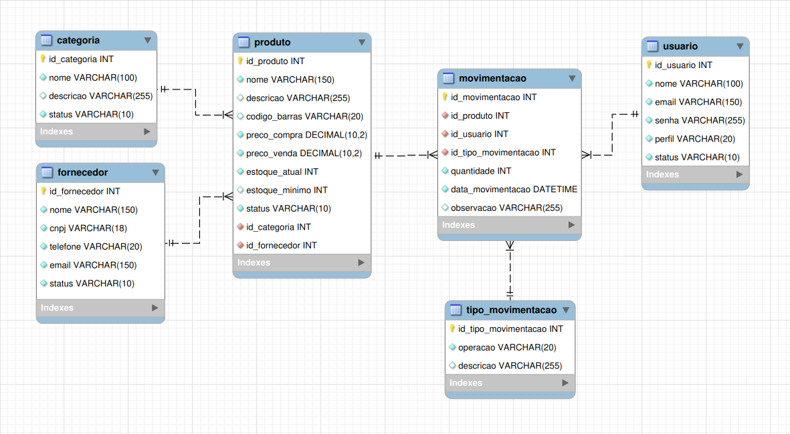

# 📦 JESTer - Sistema de Controle de Estoque (Banco de Dados)


Projeto desenvolvido para o **Projeto Integrador I** do curso Técnico em Desenvolvimento de Sistemas do Senac.

O **JESTer** é um Sistema de Controle de Estoque cuja modelagem de banco de dados foi projetada para registrar produtos, fornecedores, categorias, usuários e movimentações de estoque de forma organizada, íntegra e escalável.

---

# 📖 Sobre o Projeto

O objetivo do projeto é desenvolver um banco de dados relacional capaz de centralizar todas as informações relacionadas ao controle de estoque, substituindo controles realizados por planilhas ou registros manuais.

O sistema permite:

- Cadastro de categorias
- Cadastro de fornecedores
- Cadastro de produtos
- Cadastro de usuários
- Registro de entradas e saídas de estoque
- Histórico completo das movimentações
- Controle de permissões por perfil de usuário

---

# ✨ Funcionalidades

- Cadastro de categorias
- Cadastro de fornecedores
- Cadastro de produtos
- Cadastro de usuários
- Registro de movimentações
- Controle de estoque
- Histórico de movimentações
- Controle de acesso por perfil

---

# 🛠 Tecnologias Utilizadas

- MySQL
- SQL
- MySQL Workbench
- Java (integração futura)
- Git
- GitHub

---

# 🗂 Modelo de Dados

O banco de dados é composto pelas seguintes entidades:

- Categoria
- Produto
- Fornecedor
- Usuário
- Tipo de Movimentação
- Movimentação

As tabelas foram modeladas utilizando relacionamentos através de chaves primárias e estrangeiras para garantir a integridade referencial.

---

# 📊 Diagrama Entidade-Relacionamento

<p align="center">
    
</p>

---

# 📌 Relacionamentos

Categoria (1:N) Produto

Fornecedor (1:N) Produto

Produto (1:N) Movimentação

Usuário (1:N) Movimentação

Tipo de Movimentação (1:N) Movimentação

---

# 🧩 Estrutura do Banco

## Categoria

Responsável por classificar os produtos.

## Produto

Armazena informações do estoque.

## Fornecedor

Responsável pelo fornecimento dos produtos.

## Usuário

Controla os usuários do sistema e seus perfis de acesso.

## Tipo de Movimentação

Define se a movimentação representa entrada, saída ou ajuste.

## Movimentação

Registra todo o histórico de alterações realizadas no estoque.

---

# 🚀 Como Executar

1. Clone o repositório

```bash
git clone https://github.com/fsoaresbits/jester-database.git
```

2. Abra o MySQL Workbench

3. Execute o script SQL

4. O banco estará pronto para utilização.

---

# 📚 Conceitos Aplicados

Durante o desenvolvimento deste projeto foram utilizados conceitos como:

- Modelagem Conceitual
- Modelo Lógico
- Modelo Físico
- MER
- DER
- Normalização
- Integridade Referencial
- Chaves Primárias
- Chaves Estrangeiras
- Constraints
- Relacionamentos 1:N
- Boas práticas de nomenclatura
- Documentação técnica

---

# 🎯 Objetivos de Aprendizagem

Este projeto foi desenvolvido com o objetivo de praticar:

- Banco de Dados Relacional
- SQL
- Modelagem de Dados
- Organização de projetos
